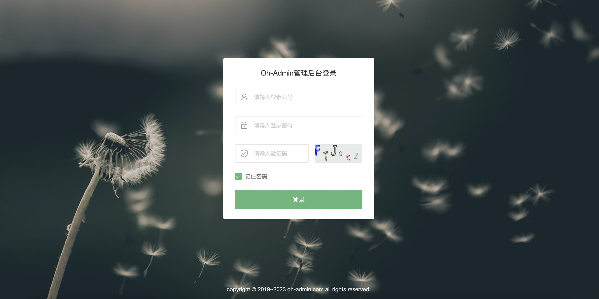
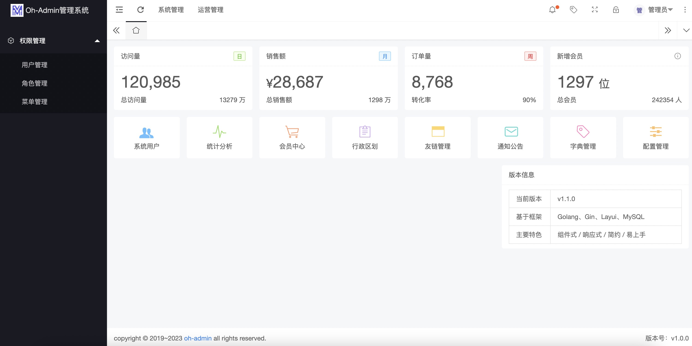
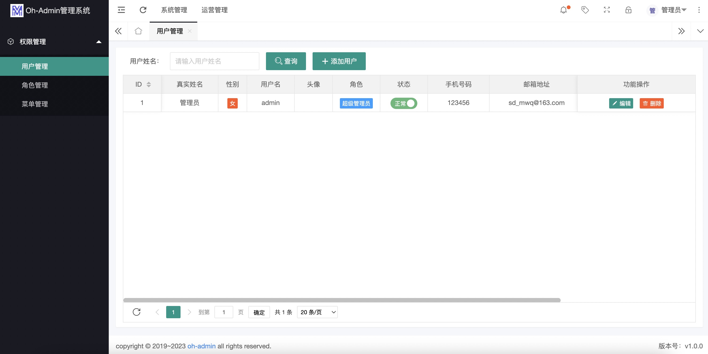
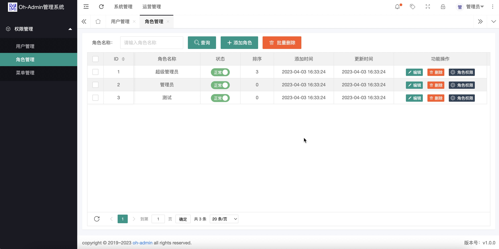
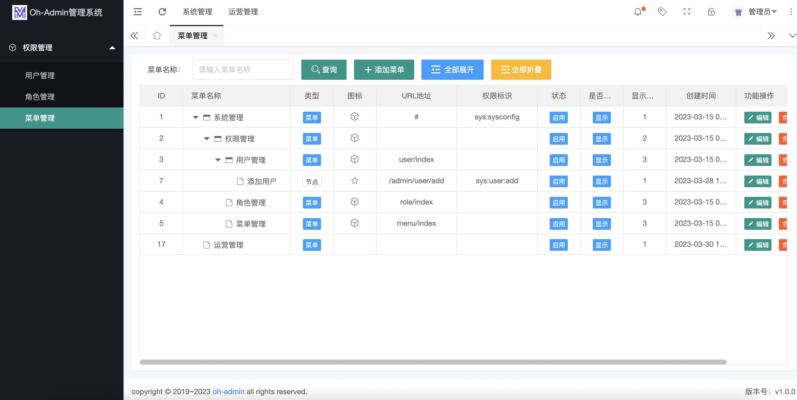

<div align="center">
<h1>Go Oh Admin</h1>

[](https://github.com/mwqnice/oh-admin)
[](https://github.com/mwqnice/oh-admin)
[](https://github.com/mwqnice/oh-admin)
[](https://github.com/mwqnice/oh-admin)
[](https://github.com/mwqnice/oh-admin)
[](https://github.com/mwqnice/oh-admin/LICENSE)
[](https://github.com/mwqnice/oh-admin/commits/main)
[](https://github.com/pre-commit/pre-commit)

<p> 🌉 基于Go+Layui实现的后台管理项目 🌉</p>


</div><br>

## 📚 项目介绍
一款 Go 语言基于Gin、Gorm、Layui、MySQL等框架实现的一个简单易用，清晰美观的现代化管理后台。

## 🍪 内置模块
+ 用户管理：用于维护管理系统的用户，常规信息的维护与账号设置。
+ 角色管理：角色菜单管理与权限分配、设置角色所拥有的菜单权限。
+ 菜单管理：配置系统菜单，操作权限，按钮权限标识等。

## 👷 开发者信息
* 系统名称：Oh-Admin后台管理项目
* 软件作者：mwqnice

## 🎨 快速开始

```bash
$ git clone https://github.com/mwqnice/oh-admin

$ cd oh-admin

# 安装依赖
$ go mod tidy

# 运行
$ go run main.go

```

## 🎨 系统演示

+ 演示地址：127.0.0.1:8088

账号 | 密码|
---|--------|
admin | 123456|

## 🍪 项目结构

```
├── configs         // 系统配置
├── docs            // 文档目录
├── global          // 系统全局变量
├── internal        // 应用目录
│   ├── dao         // DAO层
│   ├── middleware  // 中间件
│   ├── dto         // DTO层
│   ├── handler     // 控制器层
│   ├── model       // 模型层
│   ├── routers     // 路由
│   ├── vo          // VO层
│   ├── widget      // 组件层
│   └── service     // 服务层 
├── static          // 资源目录 
├── pkg             // 工具包
├── storage         // 日志存储目录
├── views           // 模板
├── go.mod
└── main.go
```

## 🔧 模块展示











## ✨  特别鸣谢
感谢[Gin](https://github.com/gin-gonic/gin)、[Layui](http://www.layui.com)等优秀开源项目。

## 🤗 另外

- 如果觉得项目不错，麻烦动动小手点个⭐️star⭐️!
- 如果你还有其他想法或者需求，欢迎在issue中交流！